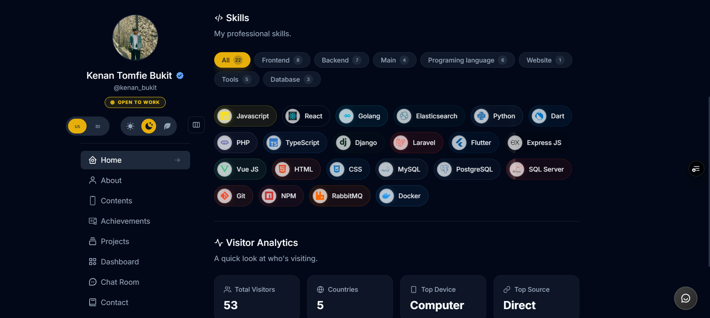

# Kenan Portfolio Architecture & Web Frontend

🔥 Personal website and portfolio built with a microservices architecture using Next.js, Go, Hono (Node.js), dan Supabase.




## 📘 Introduction

This is the main web frontend for Kenan's personal portfolio. It is part of a larger, robust microservice architecture designed for high performance, scalability, and asynchronous processing. 

This directory (`kenan-portfolio-web`) specifically houses the frontend user interface. The documentation has been updated to reflect the full architectural scale of the project.

---

## 🏗️ Architecture Overview

Proyek portofolio ini dibangun menggunakan arsitektur *microservices* dan terbagi menjadi tiga service independen:

### 1. Frontend Web (`kenan-portfolio-web`)
Antarmuka pengguna utama (repositori ini).
- **Framework:** Next.js 16 (App Router) & React 19.
- **Styling & UI:** Tailwind CSS, Framer Motion (animasi mulus), Emotion.
- **State & Data:** Zustand (global state), SWR (reactive data fetching), Axios.
- **Fitur Khusus:** Dukungan i18n (`next-intl`), visualisasi grafik dengan Chart.js, dan Markdown rendering (`react-markdown`).

### 2. Backend API Utama (`My-Portofolio-Backend`)
Service backend *lightweight* dan sangat cepat untuk menangani operasi CRUD utama dan berinteraksi langsung dengan klien web.
- **Framework:** Hono (`@hono/node-server`) berjalan di Node.js (dioptimalkan untuk Vercel).
- **Database/BaaS:** Supabase (PostgreSQL) untuk penyimpanan data portofolio.

### 3. Service Analisis & Worker (`My-Portofolio-Analysis`)
Service backend *heavy-duty* yang ditulis dalam bahasa Go (Golang) untuk memproses tugas berat, analitik, dan proses latar belakang secara asinkron.
- **Framework:** Gin Web Framework.
- **Database:** PostgreSQL via PGX dan SQLX.
- **Message Broker:** RabbitMQ (`amqp091-go`) untuk antrian pesan (*background jobs*).
- **Worker:** Cron scheduling untuk tugas berkala, memisahkan server API dan proses Worker.
- **Integrasi:** Resend (pengiriman email otomatis), Cloudinary (penyimpanan media/gambar), Maroto (pembuatan dokumen PDF), dan UASurfer untuk analitik User-Agent.

---

## 💻 Frontend Tech Stack

- **⚛️ Next.js**
- **🔰 TypeScript**
- **💠 Tailwind CSS v3**
- **🦫 Zustand**
- **〰️ SWR**
- **➰ Framer Motion**
- **💢 React Icons**
- **🌐 Next-Intl (i18n)**
- **📏 ESLint & Prettier**

---

## 🚀 Features

### 🕗 Wakatime Statistics
Menampilkan statistik pengkodean secara langsung dari Wakatime.

### 🗳 Project Showcase
Proyek-proyek disimpan di database Supabase PostgreSQL dan dirender untuk performa optimal.

### 🌍 Internationalization
Mendukung multi-bahasa menggunakan `next-intl`.

### 📊 Developer Dashboard
Dashboard interaktif yang memvisualisasikan:
- GitHub contributions
- Wakatime data
- Codewars stats
- Monkeytype typing stats

---

## 🛠 Getting Started (Frontend)

Langkah-langkah untuk menjalankan proyek **frontend web** di lokal:

### 1. Install Dependencies

Sangat disarankan menggunakan **Bun** untuk instalasi yang lebih cepat.

```bash
bun install
```

### 2. Configure Environment Variables

Salin `.env.local.example` (atau konfigurasi serupa) ke `.env.local` dan isi dengan kredensial Anda, seperti API keys untuk Supabase, Wakatime, GitHub, dll.

### 3. Run Development Server

```bash
bun run dev
# atau npm run dev
```

Buka [http://localhost:3000](http://localhost:3000) di browser Anda. Anda dapat mulai mengedit halaman di dalam folder `app/`.

---

## 📄 License

This project is licensed under the MIT License.
